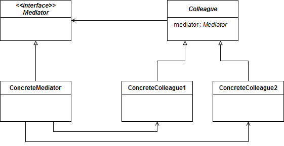

# Behavioral patterns

## Mediator pattern

**Mediator** is a behavioral pattern that encapsulates the interactions between components. The collaborations between them is restricted and channled through the **Mediator** only.

Each object, component has a reference to a mediator. The reference is made for the mediator interface, so if needed we can use different mediators and thus decouple the components.

